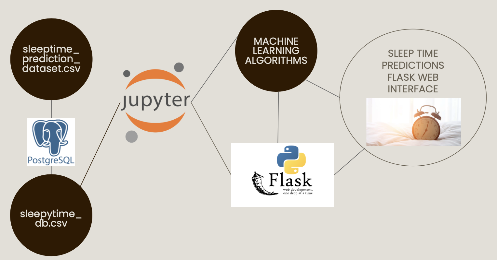
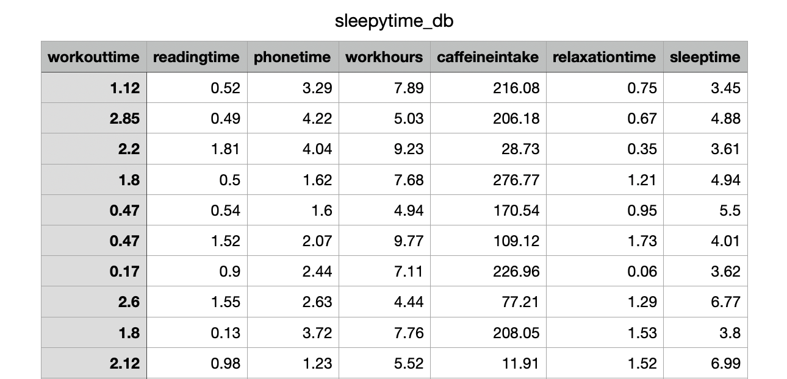
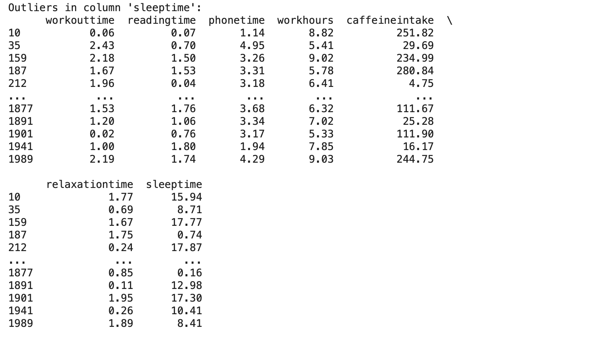
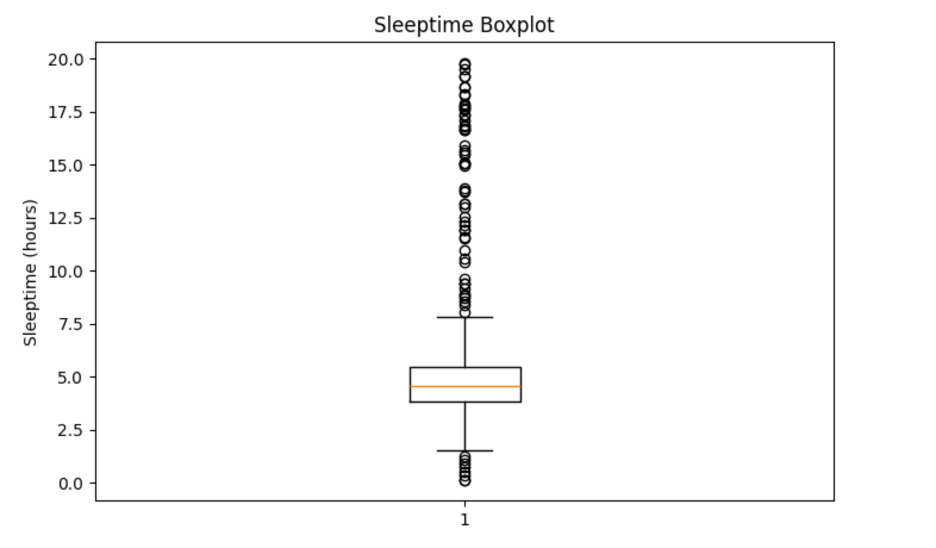
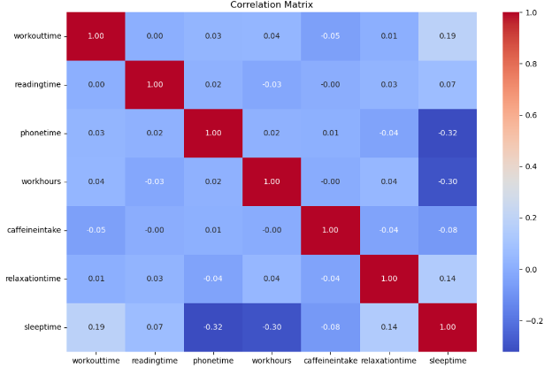
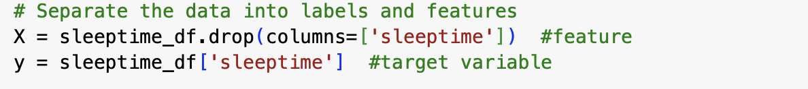
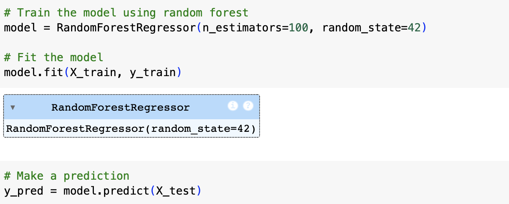
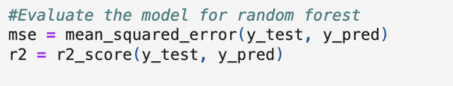
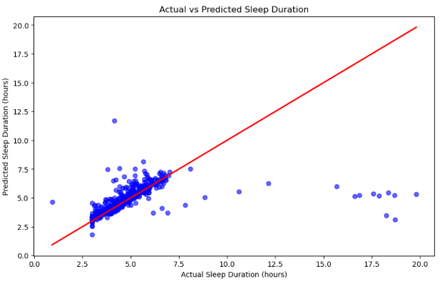
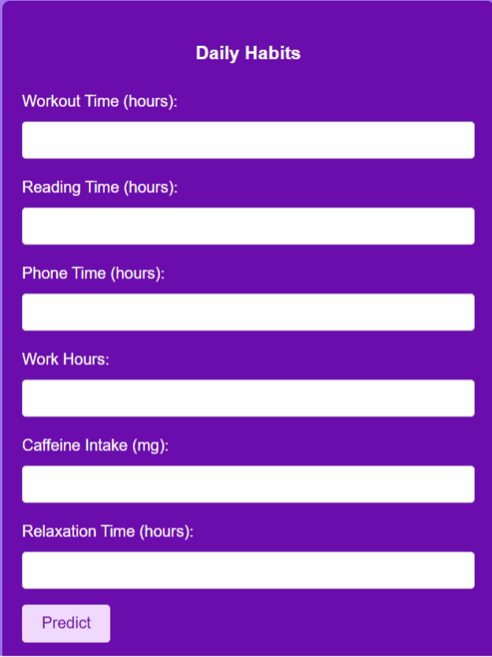

# **Project 4: Predicting Sleep Time with Machine Learning**

## **Group Members** 
* Deanna Sanchez
* Ashley Castaneda
* Shaina Joseph
* Marshall Prose
* Katelyn Suneson

## **Overview** 
Sleep is essential for an individual's overall health and well-being throughout life. The National Heart, Lung, and Blood Institute notes that during sleep, the body works to maintain and support both brain function and physical health. Sleep influences various systems in the body, including the heart, circulatory system, metabolism, respiratory system, and immune system. Chronic sleep deprivation can have serious consequences, significantly raising the risk of developing long-term health issues such as heart disease, diabetes, obesity, and weakened immune function. Additionally, lack of sleep can impair cognitive abilities, mood regulation, and emotional well-being, leading to increased stress and a reduced quality of life. Prioritizing healthy sleep habits is therefore crucial for maintaining both physical and mental health throughout an individual's life.

For our project, we utilized supervised learning to predict the average daily sleep duration based on input variables such as workout time, reading time, phone usage, work hours, caffeine consumption, and relaxation time. 

## **Tools & Libraries**
* Database/Tools
  * pgAdmin
  * Google Colab
* Languages 
  * Python
* Libraries
  * Pandas
  * Matplotlib
  * Seaborn
  * Numpy
  * TensorFlow
  * SKlearn
  * joblib

## **Methodology**
### **Project Workflow**
* We created a project workflow to outline the process of importing data from a CSV into PostgreSQL, preprocessing and storing the data, training a random forest model for predictive analysis, integrating the model with a Flash-based interface, and ensuring seamless interaction between the database, model, and user interface for real-time results and insights.

## **Preparation of Data and Quality Assessment**
### **Eliminated Null Values**

### **Renamed Columns and Exported the Data to a CSV File**

### **Found Outliers**

### **Created a Box plot**

### **Created a Correlation Matrix**

## **Supervised Learning Model**
A random forest model was used to predict the average daily sleep duration based on various input variables. This method merges multiple decision trees to enhance prediction accuracy and reliability. By incorporating factors like workout time, phone usage, caffeine intake, and others, the model is able to uncover relationships in the data. Its versatility enables it to handle both linear and non-linear patterns, making it an ideal choice for predicting sleep duration.

### **Seperate the Data into Labels and Features**
  * Generated the feature set (X) by removing the 'sleeptime' column
  * Defined the target variable (y) using the 'sleeptime' column

  

### **Split Data into Training/Testing Sets**
  * Divided the data into training and testing sets using the train_test_split function
  * Standardized the feature data (X) using the StandardScaler function

  

### **Training, Fitting, and Predicting with the Random Forest Model**
  * Taught the model using a training dataset
  * Fit the model using the training data to allow it to learn the patterns and relationships between the input features and the target variable, optimizing its internal parameters for accurate predictions
  * Used the model to predict outcomes on new data

  

### **Evaluation of the Model**
  * Calculated the Mean Squared Error and R-squared Score of the model

  

 ### **Scatter Plot of the Random Forest Model**
  * Used a scatter plot of the model to identify potential problems with the model and visualize how close the model's predictions are to actual results

  

## **Flask Web Interface**
* Created a web interface that implements a user-friendly platform for real-time predictions, enabling users to easily input data, receive immediate results, and interact with the model without needing technical knowledge

## **Analysis**
Overall, the random forest model performance appears to be suboptimal due to both the moderate MSE (5.03) and the low r-squared score (0.11). The MSE suggests that the model's predictions are not very accurate, and the r-squared score indicates that most of the variability in the target variable remains unexplained by the model. These results may highlight potential issues that could be addressed in the future through improved data preprocessing and the use of a higher-quality dataset.

## **Limitations**
* The target variable (sleeptime) is highly imbalanced. An example would be that most people sleep between 6-8 hours but a small number sleep significantly less or more. The Random Forest model may tend to predict the most frequent category, resulting in the model struggling to accurately predict the less frequent categories or outliers.

* The dataset includes features like workout time, reading time, phone usage, work hours, caffeine intake, and relaxation time. However, these features may not cover all the key factors that affect sleep time. Factors such as demographic information, stress levels, sleep environment, or genetic predispositions could be significant and are absent from the dataset leading to a model that is incomplete.

## **References**
  * https://www.kaggle.com/datasets/govindaramsriram/sleep-time-prediction/data
  * https://internet-prod.nhlbi.nih.gov/health/sleep/why-sleep-important
  

